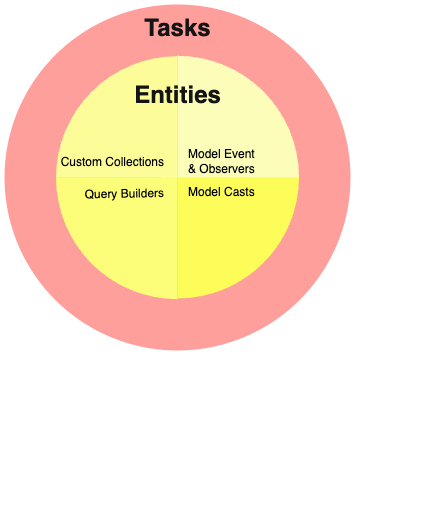

# Boring Architecture (WIP)

```
"Stick to boring architecture for as long as possible, and spend the majority of your time, and resources, building something your customers are willing to pay for." - Kelsey Hightower
```

The Clean Architecture concept, originally introduced by Robert C. Martin (Uncle Bob) over a decade ago, has seen widespread adoption in languages such as Java and C#. However, its integration is less prevalent among NodeJs and PHP developers in general.

As a software developer, I have always tried to explore ways to write code that is easily maintainable over an extended period. After successfully implementing Clean Architecture in PHP and NodeJs projects, I found it to be a promising approach. 

In last few years, I have applied Clean Architecture to Laravel and ExpressJs projects along with combining best practices from various proven practices. In this repo, I'll try to explain all these practices on which I have hands on experience and found really promising. 

I've termed this approach "Boring" Architecture because in this repo I make a case that these stable, well-understood, well-adopted and tested tools and technologies are better than shining new technologies which has limited communicaty and adoptation. These methods, tools and technologies, that I am going to recommend, are well tested, have proven scalalblity and come with extensive documentation and community support. 

The ideas given below are not just about the architecture of the system. Its also about changing the mindset and a tought process to follow best and proven practices to have a successfull project. By following tese practices, we only write production grade code that will go directly to production multiple times a day. 

## Problem Statement 
So first lets discuss why do we even need this boring architecutre. 

### Scalable
We need an architecutre which can help us to build large scale application. From large scale application we mean that the architecture support development of a project that will
- take around a year to build
- multiple teams will work on this project
- the developed application will be used for more than a decade. 

These timeframes are used only for reference, this basically means that its a large product. 

### Testable
We need an architecture where we can easily write test cases. We aim to have more than 95% of code coverage. We need to create a system in which we can test the business rules without the UI, Database, Web Server, or any other external element. 

Here this also means that the architecture itself help us to write better test cases. 

### Maintainable 
We need an architecture where we can easily maintain over the lifetime of the project. Consider that you need to implement a feature in a two week sprint but now you have to maintain it for the lifetime of the project. So writing code is only 10% of the job whereas maintaining it is the 90% of the job. So we have our core focus on the maintainability of the code. 

### Screaming architecture
We need an architecture we don't have to dig into the codebase everytime we want to look into the functionality it provides. We need an architecture through which we can get the idea by just looking at the directory structure. 


### Modularity
We need an architecture that supports modularization. Breaking down a large monolithic software into smaller, vertical monoliths makes it modular. Each module encapsulates a specific set of features or functionalities. This promotes a modular design, making the codebase more maintainable, scalable, and understandable. This also eases the team's workload because each team only needs to focus on the module they're working on.

### Reusability 
We need an architecture that help us to create reusable code. Modules can be designed to be reusable across different projects. Common functionalities like authentication, networking, or utility functions can be shared among multiple modules or projects, saving time and effort in development.

### Teamwork
We need an architecture that facilitates teamwork. Different teams can work on this project independently. This parallel development can lead to faster project delivery and improved collaboration. The overall architecture must support teamwork and team collaboration. 


# MVC Architecture
By default, Laravel ships with Model-View-Controller (MVC) architecture. MVC architecture is a widely adopted design pattern in web development. 

## MVC Components
This architecture has 3 componenets 

### Model: Managing Data and Business Logic
The Model represents the data and business logic of an application. The Model is responsible for interacting with the database and encapsulating data-related operations.

### View: Rendering User Interfaces
The View represents the user interface (UI) of the application. It is responsible for presenting data to the user and receiving user input.

### Controller: Handling User Requests

The Controller acts as an intermediary between the Model and the View. It receives and processes user requests, interacts with the Model to retrieve or modify data, and passes the processed data to the appropriate View for rendering.

## MVC Shortcomings
In MVC architecture we basically combine code based on the technical value it provides. Models are placed with models and controllers are placed with controllers. Now it causes following problems. 

### Maintinacne 
Think of a large project that has 100s of models and controllers and all of them are placed in single folder. This lead to alot of problems
- Any model can call any other which leads to spaghetti code. For example consider a situation where Model A is calling Model B. Model B calls Model C. Model C calls both Model A and Model B. This creates so much dependency of models on each other. 
- As a developer, you have to jump into the code everytime you want to get the idea of the functionality provided by each model or controller. This creates problem when you have to change the code in future or a new member of the team joins and start working on the codbase. 

### Scale
MVC looks really good in the beginning since it is provided by framework out of the box and allows rapid application development, but as the codebase grows, it start creating scalabiltiy problems. It becomes hard for different teams to work on the codebase at the same time. As the code base grows and new people join, most of the time is spent on refactoring the existing code since the codebase has reached a point where no one can easily understand it. 

### Testability
As we put more and more business logic insdie models, we can write unit tests for each function in models. This way we can test the small business logic that is provided by the system. But it becauses problem to test the complete flow of the business logic provided by that model since most of the time it is distributed among multiple models and classes. 

# Clean+ Architecture
By taking into acccount of the above problem statement and MVC shortcomings, we want an architecture that handles the above listed problems efficeiently. We are going to use clean architecture by combining it multiple other techniques so that we can achieve maintainability, scalability and testability. 

## Principles
Through out the rest of our discussion we are going to following some principles. Each principle has it’s own importance and advantages and is used where needed.

### Single responsibility principle (SRP)
The idea behind the SRP is that every class, module, or function in a program should have one responsibility/purpose in a program. As a commonly used definition, "every class should have only one reason to change".

We all know that requirements change over time. Each change in requirement also changes the code and thus the responsibility of at least one class. The more responsibilities your class has, the more often you need to change it. If your class implements multiple responsibilities, they are no longer independent of each other. In the end, you need to change your class more often, and each change is more complicated, has more side-effects


This is the foundational principle for rest of the discussion. We are going to follow this principle as much as possible.  

### Separation of Concerns

The architecture separates the application into layers, ensuring a clear distinction between business rules and external components like databases, user interfaces, and frameworks. We will dig more into this later but this basically means that there is clear separation between the technology and buisness domains. 

### Dependency Injection (DI)

This is simple pattern that means an object or function recieves other objects or functions that it requires as opposted to creating them internally. DI aims to separate the concerns of constructing objects and using them, leading to loosely coupled programs. The pattern ensures that an object or function which wants to use a given service should not have to know how to construct those services. Instead, the receiving 'client' (object or function) is provided with its dependencies by external code (an 'injector'), which it is not aware of. 

### Domain Driven Design (DDD)

DDD is a software design approach. This basically means that we are going to model the software to match the domain according to input from domain experts and we are going to primary focus on domain logic rather then the technology. Under DDD, the structure and language of the software code should match the business domain. 

### Ports and Adapters (Hexagonal) architecture

Ports and adapters is another architecture pattern that we are going to use in this. This is also called hexagonal architecture. We are not going into detail here but we are only going do disscuss about ports and adapters. 

Application core uses dedicated interfaces called “ports” to communicate with the outside world. They allow the entry or exiting of data to and from the application.

An input port (driving port) lets the application core to expose the functionality to the outside of the world. This is called "Port"

An output port (driven port) is another type of interface that is used by the application core to reach things outside of itself (like getting some data from a database). This is called "Adapter"

Using this port/adapter design, with our application in the centre of the system, allows us to keep the application isolated from the implementation details like ephemeral technologies, tools and delivery mechanisms, making it easier and faster to test and to create a reusable proof of concept.

### Event Driven Architecture

There are two aspects of using event driven architecture in this architecture. 
First one is from DDD which states that a domain event is fully fledged part of the domain model, a represenation of something that happened in the domain. we can say that domain events are related to chagnes in the domain models which we care about. 

The other one is from technology where we use events to trigger and communicate between different services to have decoupled services. 

# Implementation

So from now on we’ll keep in mind all the principles that we have discussed previously. 

## Entities
First of all let’s discuss about the Entities. The Entties conecept is present in both clean architecture and DDD. 

In clean architecture entities are placed in the centre of the architecture. According to clean architecture entities are the business objects of the application. They encapsulate the most general and high-level rules. They are the least likely to change when something external changes. For example, you would not expect these objects to be affected by a change to page navigation, or security.

In order define entities we use DDD concepts. In DDD, an ENTITY is anything that has continuity through a life cycle with a unique identifier, that are important to the application's user. It is something that changes over time. Entities have a life of their own within their Domain Model, which enables you to obtain the entire transition history of this Entity.

We start our application design by first identifying the entities within our system and this is done by having discussion with the domain experts. So let’s say we have identified some of our entities and now we want to map it to laravel. Again we are going to religiously follow single responsibility principle. 

In Laravel, Entities from clean architecture and DDD can be represented by eloquent models. Although in clean architecture, the use of ORM is discuouraged but for the sake of simplicity we are going to use eloquent models. Laravel models provides a lot of functionality in its eloquent model classes, which means that they not only represent the data in a data store, they also allow you to build queries, load and save data, have a built-in event system, and more. Which according to our discussion is too much responsibility and we need to break it into different parts based on the responsibility.


Keep in mind that models is the place where we put business logic. In the discussion about MVC, we said that the model should have all the business logic. This may be true for a small application but think about putting all the business logic inside model. It will grow so big that it will be really hard to manage it.

We are going to divide Laravel models and extract following functionality out of Laravel models to keep model classes reasonably small
- Query Scopes
- Custom collection
- Model Events
- Event Observers
- Casts

Now we have complete with the breakdown of our models. This works as entities are at the centre of our system. All the rest of the system depends on this. In the very centre, depending on nothing outside it, which contains the business objects that represent something in the domain.

The model classes are left represent relations, accessors and mutators, represent data from database and handle persistence. By dividing these model classes into multiple other classes we also tried to achieve screaming architecture in such a way that by just looking into the directory strcutre we can review which models provide events, overs or casts. By following this convention, practicing over different projects and properly documenting it would help in maintaining the project in long time. 

<p align="center">
  
  <br/>
</p>

## Tasks
Continuing our discussion on the single responsibility principle, let’s talk about the business logic and where shall we place it? In MVC we decided that all the business logic shall be in Models. 

You may have heard the term “Fat Model skinny controller”. But as you can see that we are already breaking up the model so we don’t want this functionality inside the model. That’s where tasks are used. 

Tasks are single responsibility classes that implements small part of business logic that can be reused. 

According to my experience, Tasks can contain hold one of the two 
- A database query to interact with the entities
- Any kind of calculation. 

Each Task is responsible for a small part of the logic, and it usually has a single function called run(). 


The benefit of using tasks is it helps creating single responsibility classes while reusing a piece of code, helps to easily create independently testable classes, create a boundary around entities. 

The name of the tasks should clearly tell what a task is going to do. Also while using with Laravel, its good practice to properly define datatypes of all the parameters and return type of the task. 

The task must only perform have one responsibility means it must not call another task. It should only interact with entities.

<p align="center">
  
  <br/>
</p>


## Actions
Actions represent the Use Cases of the Application. Actions can hold business logic and/or orchestrate the tasks to perform the business logic. Every Action should be responsible for performing a single use case in the application.

An Action may retrieve data from Tasks and pass data to another Task. So you can think that other than conditions based on the business logic and loops, the action is just combining different tasks to implement the use case. This helps in more code readability. 


Actions take data structures as inputs, mostly data transfer objects (DTOs), manipulate them according to the business rules, and output new data structures.

Actions should not be concerned with how the data is gathered or how it will be represented.

By just looking at the actions folder, you can determine what Use Cases are provided by the system. And by looking at all the actions you can tell what an Application can do. 

The benefit of this layer is that now the code is speaking for itself. By just looking at the actions we can understand what the application is doing and what use cases it is providing.

You can see that by dividing this layer into two we achieved that none of the action will directly access entities and that is done through tasks. 

An Action should not call another Action. Instead, if you need to reuse a big chunk of business logic in multiple Actions, and this chunk is calling some Tasks, you can create a SubActions.

Actions are mainly used from Controllers. However, they can be used from Events Listeners, Commands, and/or other Classes, but they should not be used from Tasks.

Every Action should have only a single function named run().

Actions are responsible for handling all expected Exceptions.

This also helps us in writing tests. It is now upto the development team to write tests for each tasks or write test of each action but there must be a test case for each action. 

<p align="center">
  
  <br/>
</p>

## Application layer

This layer is responsible for validating the request, serving the request data and building a response. Validation and response, happens in separate classes and usually defined inside domain, but triggered from this layer. 
This layer concept is the same as the controller in the MVC but we can add more artifacts to it like commands, jobs and events but with limited and predefined responsibilities. 

This layer has no knowledge of anything about the business logic. 

This benefit of this layer is that it is making actions reusable in multiple user interfaces.
<p align="center">
  
  <br/>
</p>

## Framework

The outermost layer is generally composed of frameworks and tools such as the Database, the Web Framework, etc. Generally we don’t write much code in this layer other than glue code that communicates to the next circle inwards. Everything from the Routes, service providers and all the third party libraries are in this layer. 

This layer provides the benefit of the laravel itself. 

<p align="center">
  
  <br/>
</p>


## Domains

So far we have been segregating the code based on functionality, but that is the fine-grained code segregation. The coarse-grained segregation of code is at least as important and it’s about segregating the code according to sub-domains and bounded contexts.

These sections of code are cross-cutting to the layers previously described, they are the components of our application. Examples of components can be Billing, User, Review or Account, but they are always related to the domain.

Just like the fine-grained code units (classes, interfaces, traits, mixins, …), also the coarsely grained code-units (domains) benefit from low coupling and high cohesion.

It’s about segregating the code according to sub-domains and bounded contexts. For example think of shopping cart  application and in this application we can separate the code based on different domains like product, billing, order etc. this means that this domain is cutting between different layers to implement a business domain. It will have it’s own entities, actions and services and each domain is providing it’s own use cases. 

To decouple classes we make use of Dependency Injection, by injecting dependencies into a class as opposed to instantiating them inside the class, and Dependency Inversion, by making the class depend on abstractions (interfaces and/or abstract classes) instead of concrete classes. This means that the depending class has no knowledge about the concrete class that it is going to use, it has no reference to the fully qualified class name of the classes that it depends on.

<p align="center">
  
  <br/>
</p>

<p align="center">
  
  <br/>
</p>

## Shared Domain

Now that we have decided about further splitting the code, the next question is how these domains are going to communicate with each other. So they can directly communicate with each other but that will yield in highly coupled domains and we don’t want that. We want to create such a system that these domains can be served as separate micro service in future so that we can scale these service independently of each other. 

Having completely decoupled domains means that a domain has no direct knowledge of any another domain. In other words, it has no reference to any fine-grained code unit from another domain. So we are going to use events, a shared domain, and eventual consistency for the communication between these domains. 

When one of our domains (domain A) needs something in another domain (domain B), we can not simply make a direct call from domain A to a class/method in domain B because A would then be coupled to B. 

However we can make A use an event dispatcher to dispatch an application event that will be delivered to any domain listening to it, including B, and the event listener in B will trigger the desired action. This means that domain A will depend on an event dispatcher, but it will be decoupled from B. Nevertheless, if the event itself “lives” in A this means that B knows about the existence of A, it is coupled to A. 

To remove this dependency, we can create a domain with a set of application core functionality that will be shared among all domains, the Shared domain. This means that the domains will both depend on the Shared domain but they will be decoupled from each other and future if we separate this domain from the system, the communication will remain the same and we’ll have no side effect overall. 

This is the benefit of this architecture that we can easily separate the domains and they are not coupled to each other and later if we want to create a microservice out of it we can just separate one of the domain and it can be easily scaled independently. Plus if we want to update the framework we just change the outer most layer of this architecture and our business logic is untouched. 

<p align="center">
  
  <br/>
</p>

## Ports and adapters

So let’s briefly discuss the flow of the control and how the data is passed between different layers in this architecture. 

As you can imagine, the typical application flow goes from the code in the user interface, through the application core to the infrastructure code, back to the application core and finally deliver a response to the user interface.

Far away from the most important code in our system, the application core, we have the tools that our application uses, for example, a database engine, a search engine, a Web server etc.

The code units that connect the tools to the application core are called adapters. The adapters are the ones that effectively implement the code that will allow the business logic to communicate with a specific tool and vice-versa. 

The adapters that tell our application to do something are called Primary Adapters while the ones that are told by our application to do something are called Secondary Adapters.

These Adapters, however, are not randomly created. They are created to fit a very specific entry point to the Application Core, and these specifications are called Port. A port is nothing more than a specification of how the tool can use the application core, or how it is used by the Application Core.

The Primary Adapters wrap around a Port and are use to tell the Application Core what to do. They translate whatever comes from a delivery mechanism into a method call in the Application Core. You can think of them as Form Requests and API Resources in laravel. 

the secondary Adapters on the opposite, implement a Port and are then injected into the Application Core, wherever the port is required. The example of this is Eloquent ORM. 

The benefit of these Adapters and ports is that if ports are defined you can easily replace adapters and it does not effect our application core. these are the things that are provided by laravel out of the box and you can just use it’s powerful functionality.  

<p align="center">
  
  <br/>
</p>


## Dependency go Inwards
The goal, as always, is to have a codebase that is loosely coupled and high cohesive, so that changes are easy, fast and safe to make. This diagram is a concept map. Knowing and understanding all of these concepts will help us plan for a healthy architecture, a healthy application. Meaning that these are just guidelines!

So how we can take benefit from this. Start creating your application by following this guide. Try to create domains that are loosely coupled with each other. Within domains we have all the use cases that are divided between actions and services. Now think of this it is very easy to add a new domain, it’s use cases. This will h

<p align="center">
  
  <br/>
</p>
